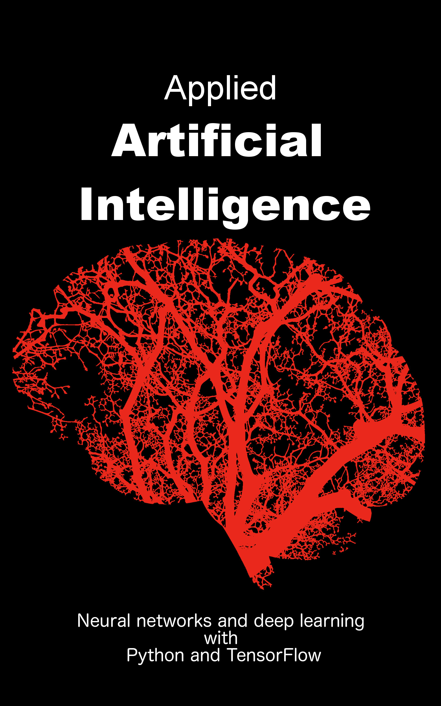

# Kindle eBook: Applied Artificial Intelligence
## Neural networks and deep learning with Python and TensorFlow

What are the secrets of modern Artificial Intelligence?
How does AI beat humans in various domains, such as playing Go or predicting the future?  
How can I implement my own Artificial Intelligence and push it into production with Google TensorFlow?
This book is about uncovering the basics of Artificial Neural Networks (ANN) and deep learning and how to implement AI models for production systems by using TensorFlow.  
The first part of this book explains how to implement your own neural networks in Python and to apply this technique to any given problem.  In step-by-step examples, the reader learns how to implement neural networks in Python and to solve non-linear problems. The book explains how neural networks are built, trained with sample data sets and how these networks are capable of solving complex problems.
The simplicity of the tutorial as well as the simple syntax of the Python language quickly enables the reader to transfer that knowledge and algorithms to any other programming language of choice.
Examples cover the design of simple neural networks for solving math functions or character recognition by using neural networks written in Python.
The second part of the book shows how to build machine learning models in Google TensorFlow and how to bring your Artificial Intelligence into production.
TensorFlow is one of the most advanced open source machine learning frameworks available today. TensorFlow easily enables data scientists to push their Artificial Intelligence into a scalable production environment.
The third part of the book is dedicated to practical and fun machine learning examples, such as to calculate book recommendations or to predict the chance of survival for passengers of RMS Titanic.

<pre>
Introduction
Artificial intelligence
   Neural networks and deep learning
      Activation of a neuron
      Training a single neuron
      Model a network of neurons
   Use-case: Handwriting and character recognition
Taxonomy of machine learning use-cases
   Classification
   Regression
   Clustering
AI in production with TensorFlow
   System architecture
   Distribution architecture
   Run TensorFlow as a Docker container
   Building your first computational graph
      TensorFlow functions
      Trace TensorFlow functions with TensorBoard
   Implement a first linear regression model
Build a first model with Keras
   Trace a Keras model using TensorBoard
   Keras take-aways
Titanic: Can we train a model to predict survival?
   Preparing and massaging the training data
   Trace of the Titanic model training
   Titanic survival prediction summary
Crowd Intelligence: Build your own book recommender
   Load example book ratings
   Building the Matrix Factorization Keras Model
   Training the matrix factorization model
   Final book to user rating and recommendation
   Go beyond: The Book-Crossing dataset
Sentiment Analysis: How to detect Toxic Comments?
   Retrieve and load the text data set
   Representing text as numeric features
      One-hot encoding
      Word index encoding
      Word embeddings
   Training a word embedding
   Predict toxic texts
   Safe your trained word embedding to disk
Summary
References
Contact and download links
Credits
</pre>

